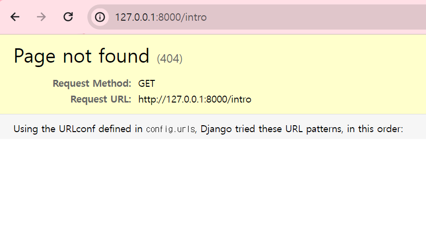

# Django

- [개발 환경 설정](#개발-환경-설정)
- [장고 프로젝트 생성](#장고-프로젝트-생성)
- [개발 서버 확인](#개발-서버-확인)
- [앱 성성](#앱-생성)
- [View와 URL 맵핑](#view와-url-맵핑)
- [App migration](#app-migration)
- [모델 작성](#모델-작성하기)

## 개발 환경 설정
### 파이썬 가상 환경 생성
파이썬 특정 버전을 사용하는 가상 환경을 만들기 위해 `py -version -m venv {가상환경이름}` 와 같은 명령을 입력한다. 예를 들어, 다음과 같이 3.11.5 버전을 사용하며 venv라는 가상환경을 만들 수 있다.

```bash
py -3.11 -m venv venv
```
VSCODE를 사용하는 경우에는 다음과 같이 python interpreter를 선택할 수 있다. 방금 생성된 가상환경을 선택 해 주면 된다. 


그리고 VSCODE내의 터미날 창에서 가상환경이 활성화 되어 있는지 확인이 가능하며 버전을 출력해 볼 수 있다.


### 장고 설치
앞으로 모든 작업은 위에서 생성한 가상 환경에서 수행한다는 것을 잊지 말자. 장고는 `pip install django` 명령으로 설치 한다.

## 장고 프로젝트 생성
프로젝트 폴더에 아래 명령으로 장고 프로젝트를 셋업 할 수 있다.

```bash
django-admin startproject config .
```

## 개발 서버 확인
위의 명령을 실행하면 해당 디렉토리에 `config` 폴더와 `manage.py` 파일이 자동으로 생성된다. 터미널에서 manage.py 파일이 존재하는 해당 디렉토리에서 아래 명령을 실행하면 기본 내장 서버가 동작한다.

```bash
python manage.py runserver
```
아래와 같이 실행 후 로그를 살펴보면 http://127.0.0.1:8000 에서 서버가 동작하고 있음을 알 수 있다 (붉은색 글씨는 일단 무시하자). 웹브라우저에서 해당 주소를 입력하여 내장 서버가 정상 동작 하는 지 확인 한다.


## 앱 생성
프로젝트 생성 후 내장 서버가 잘 동작하는 것을 확인했다. 이제 URL을 맵핑하기 위해 App을 생성해야 한다. 예를 들어, `http://localhost:8000/intro` 라는 화면을 만들고 싶을때 `intro` 가 하나의 app이 된다. 아래 명령으로 app을 생성하기 위해 장고에서 지원하는 기본 명령을 실행한다.

```bash
django-admin startapp intro
```
이제 아래 화면처럼 프로젝트 폴더 아래 config 폴더와 아울러 방금 생성한 intro app관련한 폴더가 새로 생기고 관련 파일이 생성된다.


## View와 URL 맵핑
이제 방금 생성한 app을 확인해 보기 위해 `python manage.py runserver`를 실행하고 웹브라우저에서 `http://localhost:8000/intro`를 입력하면 아래와 같이 `Pages not found`화면이 나온다.



이제 해당 URL과 view를 맵핑해 주어야 한다. 우선, `config/urls.py`를 아래와 같이 수정 후 `intro/urls.py`를 새로 생성한다.

```python
from django.contrib import admin
from django.urls import path, include

urlpatterns = [
    path('admin/', admin.site.urls),
    path('intro/', include('intro.urls'))
]
```

intro/urls.py에는 다음과 같이 코드를 입력한다.

```python
from django.urls import path

from . import views

urlpatterns = [
    path('', views.index),
]
```

마지막으로, `intro/views.py` 에 다음의 코드를 삽입한다.
```python
from django.shortcuts import render
from django.http import HttpResponse

# Create your views here.
def index(request):
    return HttpResponse("Hello, here is intro pages")
```

이제 코드 흐름을 살펴보면, http://localhost:8000/intro 요청이 웹브라우저에서 장고 서버로 전달되면
- config/urls.py로 전달
- intro.urls로 재 전달
- intro/urls.py가 해당 요청에 맞는 view.index를 찾아 실행

하는 흐름이다.

## App migration
내장 서버를 실행하면 아래와 같이 18개의 적용되지 않은 migration이 있다고 경고 문구가 나온다.


`config/settings.py`를 보면 장고 프로젝트 생성 시 기본적으로 설치가 되는 앱들이 있다.
```python
# Application definition

INSTALLED_APPS = [
    'django.contrib.admin',
    'django.contrib.auth',
    'django.contrib.contenttypes',
    'django.contrib.sessions',
    'django.contrib.messages',
    'django.contrib.staticfiles',
]
```
또한, 아래와 같이 데이터베이스 정보도 기본적으로 포함되어 있다.
```python
# Database
# https://docs.djangoproject.com/en/4.2/ref/settings/#databases

DATABASES = {
    'default': {
        'ENGINE': 'django.db.backends.sqlite3',
        'NAME': BASE_DIR / 'db.sqlite3',
    }
}
```
`SQLite`를 사용하고 해당 파일은 `db.sqlite3`에 생성되는 것으로 볼 수 있다. 이제 다시 경고 문구를 살펴 보면 다음과 같다. `Your project may not work properly until you apply the migrations for app(s): admin, auth, contenttypes, sessions.      
Run 'python manage.py migrate' to apply them.` 그럼 이제 `python manage.py migrate` 명령을 실행해 보자.

```bash
(venv) d:\work\backguru\django\projects\mysite>python manage.py migrate
Operations to perform:
  Apply all migrations: admin, auth, contenttypes, sessions
Running migrations:
  Applying contenttypes.0001_initial... OK
  Applying auth.0001_initial... OK
  Applying admin.0001_initial... OK
  Applying admin.0002_logentry_remove_auto_add... OK
  Applying admin.0003_logentry_add_action_flag_choices... OK
  Applying contenttypes.0002_remove_content_type_name... OK
  Applying auth.0002_alter_permission_name_max_length... OK
  Applying auth.0003_alter_user_email_max_length... OK
  Applying auth.0004_alter_user_username_opts... OK
  Applying auth.0005_alter_user_last_login_null... OK
  Applying auth.0006_require_contenttypes_0002... OK
  Applying auth.0007_alter_validators_add_error_messages... OK
  Applying auth.0008_alter_user_username_max_length... OK
  Applying auth.0009_alter_user_last_name_max_length... OK
  Applying auth.0010_alter_group_name_max_length... OK
  Applying auth.0011_update_proxy_permissions... OK
  Applying auth.0012_alter_user_first_name_max_length... OK
  Applying sessions.0001_initial... OK
```

이제 앞서 설명한 `db.sqlite3` 파일을 DBeaver로 열어 보면 해당 데이터베이스 테이블이 생성된 것을 확인할 수 있다.


결론적으로 migrate는 장고 프로젝트 생성 시 자동으로 만들어진 앱들에 대한 DB 테이블을 생성하는 것을 의미한다.

## 모델 작성하기
