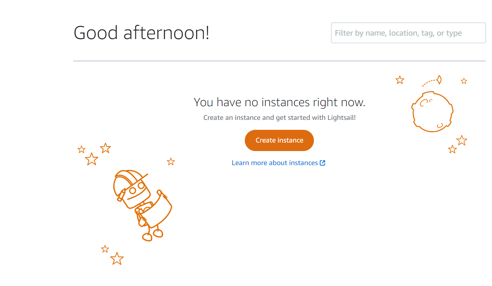

# Django

- [개발 환경 설정](#개발-환경-설정)
- [장고 프로젝트 생성](#장고-프로젝트-생성)
- [개발 서버 확인](#개발-서버-확인)
- [앱 성성](#앱-생성)
- [View와 URL 맵핑](#view와-url-맵핑)
- [App migration](#app-migration)
- [모델과 뷰](#모델과-뷰)
- [장고 어드민](#장고-어드민)
- [AWS 인스턴스 생성](#aws-인스턴스-생성)
- [AWS 서버 설정 및 장고 서비스 실행](#aws-서버-설정-및-장고-서비스-실행)

## 개발 환경 설정
### 파이썬 가상 환경 생성
파이썬 특정 버전을 사용하는 가상 환경을 만들기 위해 `py -version -m venv {가상환경이름}` 와 같은 명령을 입력한다. 예를 들어, 다음과 같이 3.11.5 버전을 사용하며 venv라는 가상환경을 만들 수 있다.

```bash
py -3.11 -m venv venv
```
VSCODE를 사용하는 경우에는 다음과 같이 python interpreter를 선택할 수 있다. 방금 생성된 가상환경을 선택 해 주면 된다. 


그리고 VSCODE내의 터미날 창에서 가상환경이 활성화 되어 있는지 확인이 가능하며 버전을 출력해 볼 수 있다.


### 장고 설치
앞으로 모든 작업은 위에서 생성한 가상 환경에서 수행한다는 것을 잊지 말자. 장고는 `pip install django` 명령으로 설치 한다. 버전은 다음과 같이 확인 가능하다.

```bash
python -m django --version
```

## 장고 프로젝트 생성
프로젝트 폴더에 아래 명령으로 장고 프로젝트를 셋업 할 수 있다.

```bash
django-admin startproject config .
```

## 개발 서버 확인
위의 명령을 실행하면 해당 디렉토리에 `config` 폴더와 `manage.py` 파일이 자동으로 생성된다. 터미널에서 manage.py 파일이 존재하는 해당 디렉토리에서 아래 명령을 실행하면 기본 내장 서버가 동작한다.

```bash
python manage.py runserver
```
아래와 같이 실행 후 로그를 살펴보면 http://127.0.0.1:8000 에서 서버가 동작하고 있음을 알 수 있다 (붉은색 글씨는 일단 무시하자). 웹브라우저에서 해당 주소를 입력하여 내장 서버가 정상 동작 하는 지 확인 한다.


## 앱 생성
프로젝트 생성 후 내장 서버가 잘 동작하는 것을 확인했다. 이제 URL을 맵핑하기 위해 App을 생성해야 한다. 예를 들어, `http://localhost:8000/intro` 라는 화면을 만들고 싶을때 `intro` 가 하나의 app이 된다. 아래 명령으로 app을 생성하기 위해 장고에서 지원하는 기본 명령을 실행한다.

```bash
django-admin startapp intro
```
이제 아래 화면처럼 프로젝트 폴더 아래 config 폴더와 아울러 방금 생성한 intro app관련한 폴더가 새로 생기고 관련 파일이 생성된다.


## View와 URL 맵핑
이제 방금 생성한 app을 확인해 보기 위해 `python manage.py runserver`를 실행하고 웹브라우저에서 `http://localhost:8000/intro`를 입력하면 아래와 같이 `Pages not found`화면이 나온다.


이제 해당 URL과 view를 맵핑해 주어야 한다. 우선, `config/urls.py`를 아래와 같이 수정 후 `intro/urls.py`를 새로 생성한다.

```python
from django.contrib import admin
from django.urls import path, include

urlpatterns = [
    path('admin/', admin.site.urls),
    path('intro/', include('intro.urls'))
]
```

intro/urls.py에는 다음과 같이 코드를 입력한다.

```python
from django.urls import path

from . import views

urlpatterns = [
    path('', views.index),
]
```

마지막으로, `intro/views.py` 에 다음의 코드를 삽입한다.
```python
from django.shortcuts import render
from django.http import HttpResponse

# Create your views here.
def index(request):
    return HttpResponse("Hello, here is intro pages")
```

이제 코드 흐름을 살펴보면, http://localhost:8000/intro 요청이 웹브라우저에서 장고 서버로 전달되면
- config/urls.py로 전달
- intro.urls로 재 전달
- intro/urls.py가 해당 요청에 맞는 view.index를 찾아 실행

하는 흐름이다.

## App migration
내장 서버를 실행하면 아래와 같이 18개의 적용되지 않은 migration이 있다고 경고 문구가 나온다.


`config/settings.py`를 보면 장고 프로젝트 생성 시 기본적으로 설치가 되는 앱들이 있다.
```python
# Application definition

INSTALLED_APPS = [
    'django.contrib.admin',
    'django.contrib.auth',
    'django.contrib.contenttypes',
    'django.contrib.sessions',
    'django.contrib.messages',
    'django.contrib.staticfiles',
]
```
또한, 아래와 같이 데이터베이스 정보도 기본적으로 포함되어 있다.
```python
# Database
# https://docs.djangoproject.com/en/4.2/ref/settings/#databases

DATABASES = {
    'default': {
        'ENGINE': 'django.db.backends.sqlite3',
        'NAME': BASE_DIR / 'db.sqlite3',
    }
}
```
`SQLite`를 사용하고 해당 파일은 `db.sqlite3`에 생성되는 것으로 볼 수 있다. 이제 다시 경고 문구를 살펴 보면 다음과 같다. `Your project may not work properly until you apply the migrations for app(s): admin, auth, contenttypes, sessions.      
Run 'python manage.py migrate' to apply them.` 그럼 이제 `python manage.py migrate` 명령을 실행해 보자.

```bash
(venv) d:\work\backguru\django\projects\mysite>python manage.py migrate
Operations to perform:
  Apply all migrations: admin, auth, contenttypes, sessions
Running migrations:
  Applying contenttypes.0001_initial... OK
  Applying auth.0001_initial... OK
  Applying admin.0001_initial... OK
  Applying admin.0002_logentry_remove_auto_add... OK
  Applying admin.0003_logentry_add_action_flag_choices... OK
  Applying contenttypes.0002_remove_content_type_name... OK
  Applying auth.0002_alter_permission_name_max_length... OK
  Applying auth.0003_alter_user_email_max_length... OK
  Applying auth.0004_alter_user_username_opts... OK
  Applying auth.0005_alter_user_last_login_null... OK
  Applying auth.0006_require_contenttypes_0002... OK
  Applying auth.0007_alter_validators_add_error_messages... OK
  Applying auth.0008_alter_user_username_max_length... OK
  Applying auth.0009_alter_user_last_name_max_length... OK
  Applying auth.0010_alter_group_name_max_length... OK
  Applying auth.0011_update_proxy_permissions... OK
  Applying auth.0012_alter_user_first_name_max_length... OK
  Applying sessions.0001_initial... OK
```

이제 앞서 설명한 `db.sqlite3` 파일을 DBeaver로 열어 보면 해당 데이터베이스 테이블이 생성된 것을 확인할 수 있다.


결론적으로 migrate는 장고 프로젝트 생성 시 자동으로 만들어진 앱들에 대한 DB 테이블을 생성하는 것을 의미한다.

만약, 새로 생성한 app의 DB 테이블을 생성할 경우에는 `config/setting.py`의 `INSTALLED_APPS` 에 아래 코드와 같이 삽입을 해 주어야 한다.
```python
# Application definition

INSTALLED_APPS = [
    'django.contrib.admin',
    'django.contrib.auth',
    'django.contrib.contenttypes',
    'django.contrib.sessions',
    'django.contrib.messages',
    'django.contrib.staticfiles',
]
```

예를 들어, intro app을 생성 시 자동으로 만들어지는 `intro/app.py`의 `intro.apps.IntroConfig`를 추가해 주면 된다.
그리고, 새로 추가된 app을 인식 시켜 주기 위해 `python manage.py makemigrations`를 먼저 실행 후 `python manage.py migrate`를 다시 실행한다.


## 모델과 뷰
장고에서 모델(Model)은 데이터베이스와 상호 작용하고 데이터를 정의하는데 사용되는 부분이다. 장고에서 모델은 데이터베이스의 테이블과 1:1로 매핑되는데, 이를 통해 데이터의 구조를 정의하고 데이터베이스와의 상호 작용을 쉽게 할 수 있다. 예를 들어, 학생 정보를 저장하는 모델을 만들면 다음과 같다.

```python
# models.py

from django.db import models

class Student(models.Model):
    student_id = models.AutoField(primary_key=True)
    name = models.CharField(max_length=255)
    major = models.CharField(max_length=255)
```
모델을 정의한 후에는 이를 데이터베이스에 반영하기 위해 장고의 migrate 명령을 사용한다.
뷰(View)는 사용자의 요청을 처리하고 데이터를 반환하는 부분이다. 뷰는 웹 애플리케이션의 비즈니스 로직을 담당하며, 모델로부터 데이터를 가져와 템플릿에 전달한다.

```python
# views.py

from django.shortcuts import render
from .models import Student

def student_list(request):
    students = Student.objects.all()
    return render(request, 'students/student_list.html', {'students': students})
```

위의 코드와 같이 뷰는 요청을 받아 처리하고, 모델로부터 데이터를 가져와 템플릿에 전달하는 역할을 한다.
템플릿(Template)은 HTML 코드와 함께 동적으로 데이터를 표시하기 위한 장고의 도구이다. 뷰에서 전달받은 데이터를 템플릿에서 사용하여 웹 페이지를 동적으로 생성할 수 있다.

```python
<!-- student_list.html -->

<ul>
  
    <li>{{ student.name }} - {{ student.major }}</li>
  
</ul>
```
이러한 구성 요소들이 함께 작동하여 장고 애플리케이션은 모델에서 데이터를 관리하고, 뷰에서 비즈니스 로직을 처리하며, 템플릿에서 데이터를 동적으로 표시할 수 있도록 한다.

## 장고 어드민
장고에서 기본적으로 제공하는 어드민 페이지를 이용할 수 있다. 우선 `python manage.py createsuperuser`를 입력하여 슈퍼유저를 생성한다. 아래는 사용자 이름 `admin`, 이메일 주소는 `backing.dev@gmail.com`, 비밀번호 `1234` 로 설정하는 화면이다.

```bash
(venv) D:\work\backguru\django\projects\mysite>python manage.py createsuperuser
Username (leave blank to use 'tonyc'): admin
Email address: backing.dev@gmail.com
Password: 
Password (again): 
This password is too short. It must contain at least 8 characters.
This password is too common.
This password is entirely numeric.
Bypass password validation and create user anyway? [y/N]: y
Superuser created successfully.
```
이제 `python manage.py runserver` 입력하여 내장 서버를 실행 시킨 후 `http://localhost:8000/admin` 으로 진입하여 앞서 설정한 계정 정보를 입력하면 아래와 같은 화면에 진입한다.


## AWS 인스턴스 생성
AWS lightsail에서 인스턴스를 생성하고 장고 웹서비스를 배포해 본다. [여기](https://lightsail.aws.amazon.com/ls/webapp/home/instances)에 접속하여 인스턴스를 생성할 수 있다.



`create instance` 버튼을 클릭하여 다음 화면같이 Linux/ubuntu를 선택한다.


이제 가격정책을 선택한다. 3개월은 무료로 사용할 수 있다. 


이제 `인스턴스생성` 버튼을 클릭하여 인스턴스 생성을 시작하여 잠시후 아래와 같이 인스턴스 생성이 완료되는 것을 확인할 수 있다.


위의 화면에서 인스턴스 이름(backguru-t)를 클릭하여 아래와 같은 화면에 진입할 수 있다.


해당 화면에서 생성한 우분투 서버에 연결 할 수 있는 IP주소 정보를 볼 수 있다. 만약 특정 SSH 클라이언트 (예: MobaXterm) 를 이용해서 SSH 접속하기 위해서는 SSH Key를 생성해야 한다. SSH Key를 생성하기 위해서는 해당 화면을 참고한다. SSH 접속이 된다면 생성이 성공적으로 완료된 것이다.

*추가적으로 public IP를 만들고 방화벽 규칙을 생성하여 외부에서 접근 가능한 장고 서버 서비스를 실행할 수 있도록 한다. 만약, 장고 서비스가 8000포트에서 수행된다면 8000포트를 개방해줘야 한다.*

## AWS 서버 설정 및 장고 서비스 실행
앞서 생성한 우분투 서버에 SSH로 접속을 하여 호스트 네임을 변경해 준다. 예를 들어, 아래와 같이 backguru로 변경을 하자.

```shell
sudo hostnamectl set-hostname backguru
```

그리고 서버를 재시작한다.

```shell
sudo reboot
```

재접속하여 변경된 프롬프트를 확인할 수 있다. 그리고 아래의 명령으로 호스트네임을 확인 할 수 있다.

```shell
hostname
```
이제 우분투서버에 가상환경을 사용할 수 있도록 python3-venv를 설치한다. 먼저 아래 명령으로 우분투 패키지를 최신으로 업데이트 한다.

```shell
sudo apt update

```

아래의 명령으로 가상환경을 설치한다. 질문이 나오면 무조선 `enter`클릭한다.
```shell
sudo apt install python3-venv
```
홈 디렉토리에 장고 프로젝트 디렉토리와 venv 디렉토리를 생성한 후 venv 폴더에서 아래 명령으로 가상환경을 설정한다.

```shell
python3 -m venv <project-name>
```
위와 같이 폴더 구조를 설정할 경우 프로젝트 마다 다른 가상환경이 필요할 때 마다 venv 하위에 해당 프로젝트 이름으로 가상환경을 설치 할 수 있다. 이제 venv/<project-name>/bin 하위에 있는 activate 스크립트를 실행한다.

```shell
. activate
```
또는
```shell
source activate
```

이제 쉘 프롬프트 맨 앞에 (<project-name>)가 표시되는 것을 볼 수 있다. 예를 들어 다음과 같다.

```shell
ubuntu@backguru:~/venvs$ cd mysite
ubuntu@backguru:~/venvs/mysite$ cd bin
ubuntu@backguru:~/venvs/mysite/bin$ . activate
(mysite) ubuntu@backguru:~/venvs/mysite/bin$
```

만약 가상 환경에서 벗어나려면 아무 곳에서나 deactivate 명령을 수행하면 된다. 이제 django와 markdown을 설치한다.

```shell
pip install wheel
pip install django==4.2.9
pip install markdown 
```
이제 *~/projects* 디렉토리에 장고 서버 소스를 저장한다. 그리고, 로컬에서 서버를 구동하던 방식과 동일하게 수행할 수 있으나, `config/setting.py`에서 아래와 같이 ALLOWED_HOSTS에 앞서 설정한 고정IP를 입력해 주어야 한다.

```python
ALLOWED_HOSTS = ['<고정-IP']


# Application definition

INSTALLED_APPS = [
    'common.apps.CommonConfig',
    'pybo.apps.PyboConfig',
    'django.contrib.admin',
    'django.contrib.auth',
    'django.contrib.contenttypes',
    'django.contrib.sessions',
    'django.contrib.messages',
    'django.contrib.staticfiles',
]
```
그리고 마지막으로 아래 명령으로 서버에 서비스를 실행한다.

```shell
python manage.py runserver 0:8000
```
